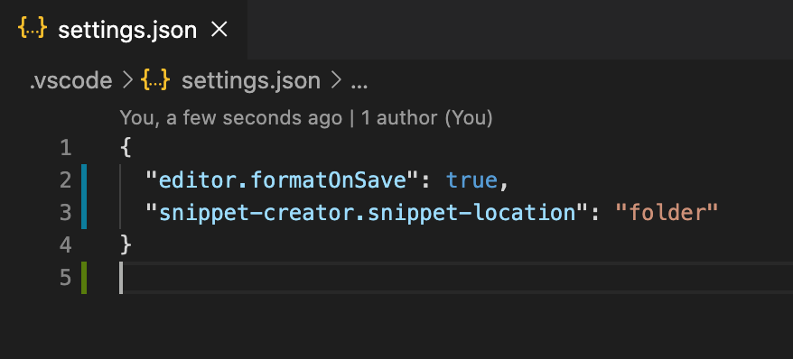

# Snippet Creator

Quickly create a snippet. While creating, it auto-detects which language you're using.

## Configuration

Snippets can be created into user snippets or folder snippets. By default folder config is used.

## License

MIT. See LICENSE.
